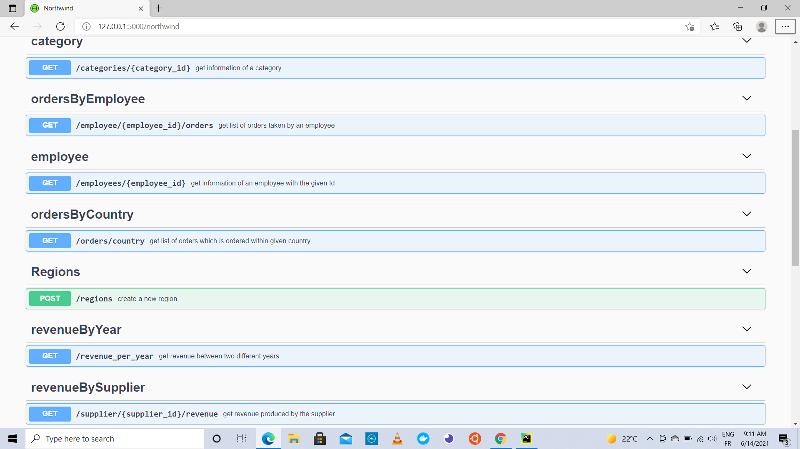

# Northwind
Northwind is an e-commerce application, right now it only performs basic api calls. This project will be updated as required, to perform as a complete e-commerce application in future stay connected. 
### To SetUp and Start
```
pip install -r requirements.txt 
python run.py
 ```
### Link to swagger api_specs
[Northwind](http://127.0.0.1:5000/northwind)
### Swagger UI 

